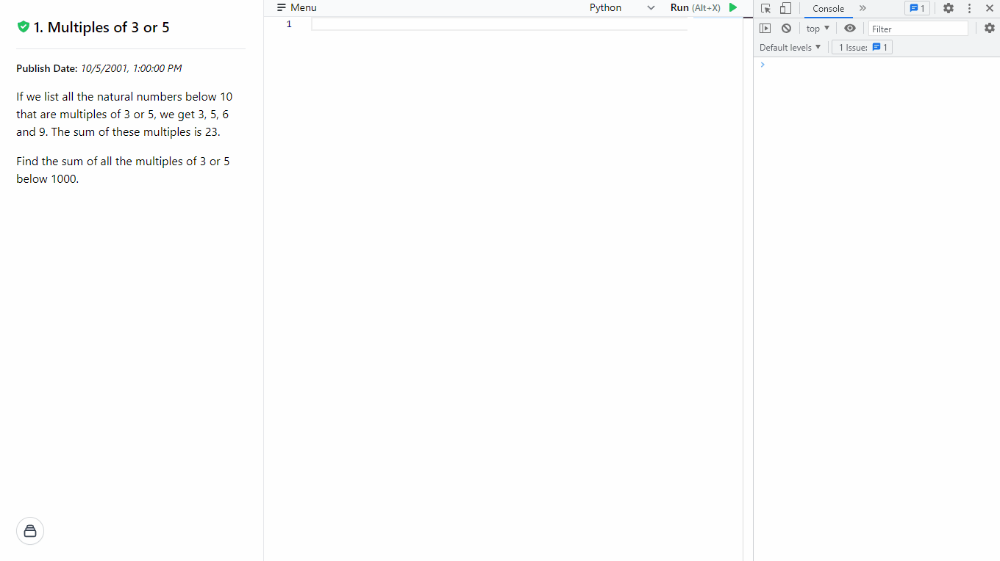

<p align="center">
  
  <br/>
  <a href="https://euler.haku.dev" align="center">Project Euler API</a>
  <p align="center">A simple API to check your answer of a Project Euler question.</p>
</p>

---

# How to use the API?

## Request

### Method 1

Send any type of `HTTP` requests to [https://euler.haku.dev/api](https://euler.haku.dev/api) with query parameters `q` and `a`.

`q` is the question number, and `a` is the answer, both required.

**Example:** _(question 1; answer: 123456)_

```shell
https://euler.haku.dev/api?q=1&a=123456
```

### Method 2

Send any type of `HTTP` requests to [https://euler.haku.dev/api/<question_number>/<answer\>](https://euler.haku.dev/api).

`answer` should be URL-encoded if needed. E.g., `/` in the answer.

**Example:** _(question 123; answer: 456/789)_

```shell
https://euler.haku.dev/api/123/456%2F789
```

## Response

There're only 3 success responses, `1`, `0`, or `-1`.

- `1`: Correct

- `0`: Incorrect

- `-1`: Answer Not Found

# Playground ✨

**Playground Links**: [https://euler.haku.dev/playground](https://euler.haku.dev/playground)

A browser playground is later added to the project, a place where you can view the problem, write your code, execute your code, and check your answer.

Currently the playground only supports `JavaScript` and `Python`:

- **JavaScript**: Using the native JS [`Function`](https://developer.mozilla.org/en-US/docs/Web/JavaScript/Reference/Global_Objects/Function) object to run your JavaScript code.
- **Python**: Using [`Pyodide`](https://pyodide.org), a Python WASM Library to run Python in the browser.



> **Note**
>
> New questions update: the scraper is set to run once a week to avoid hitting the Project Euler website too frequently, and also Project Euler doesn't add new questions that often, so the scraping rate should be just fine.

## How to use the Playground?

### Select Questions

Questions can be selected from the hidden side menu, click the button on the bottom left of the page to open the side menu.

### Code Editor

The code editor is using the [Monaco Editor](https://microsoft.github.io/monaco-editor/) library, the editor that powers VS Code. It supports some basic commands, press `F1` to open the command list.

#### Choose your languange

JavaScript is the default languange, you can switch to Python from the dropdown on the top right. The chosen languange will affect the save, snippet, and export function (see menu section below). It will also affect the syntax checking and code highlighting of the code editor.

#### ☰ Menu (Some custom editor functions)

##### `Save Code`

> Save the current code, it will be saved to the IndexedDB in your browser. Each languange is saved separately.
>
> **Warning**
>
> Clearing the browser caches will delete all you saves, make sure you export all your code before doing that.

##### `Load Code`

> Load the code that you saved for the current question and the current selected language.

##### `Load Snippet`

> Load a code snippet into the editor, it contains a function that calls the API and checks your answer. The snippet is based on the programming languange you selected.

##### `Export Code to File`

> Download the current code. A single code file will be downloaded.

##### `Export All Saved Code`

> Download all the code that you saved in your browser's IndexedDB. A `.zip` archive that contains all the code files will be downloaded.

#### Run your code ▶️

Press `F12` or right-click on the page and select "Inspect" to open the browser dev tool. Click the "Console" tab on the top, the output of your code will be displayed here. Now you can click the "Run" button.

# Answers Scraper 🕷

## Thanks

All answers are from [luckytoilet/projecteuler-solutions] maintained by [Bai Li](https://github.com/luckytoilet).

## Updates

A GitHub Action workflow will check the solution file on [projecteuler-solutions] everyday and update the answers file on this project if there're any new answers. That means if [projecteuler-solutions] doesn't have the answer, the API will not have it, too. You will get a `?` response in such case.

## Issue

If you solved a problem but it is not on [projecteuler-solutions]. You can send a pull request to that repository, and this project will update the answer automatically in 12 hours after the pull request is merged.

If your have the correct answer submitted to Project Euler and identical to the one on [projecteuler-solutions], but the API response you a `0` after calling it correctly. Please post an issue on this repository to let me know. I will work on a update to fix the issue.

# Why this project?

I am too lazy, yup. I don't want to keep copying and pasting the answer to Project Euler's site, just want to pass my answer to a resquest function after the code finish running and check if I got it correct.

## P.S.

Although all the answers are open on [luckytoilet/projecteuler-solutions] and this project, but please do solve the problem yourself and don't lie to yourself and submit the answer to Project Euler without solving it on you own. This is merely a tool to check your answer, not solving it for you.

[luckytoilet/projecteuler-solutions]: https://github.com/luckytoilet/projecteuler-solutions
[projecteuler-solutions]: https://github.com/luckytoilet/projecteuler-solutions
